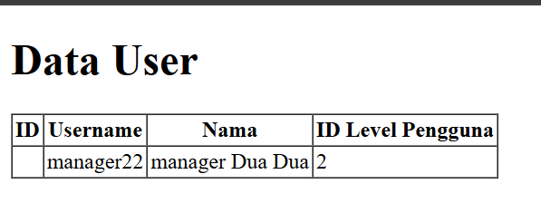

<h2 style ="font-family: calibri ; text-align: center;"> LAPORAN PRAKTIKUM WEB LANJUT  JOBSHEET 4</h2>

 

  Nama :Sesy Tana Lina Rahmatin
 
  Kelas :TI-2A
 
  NIM : 2341720029

--------------------------------------------------------------------------------------------------------------------------

## Praktikum 1 - $fillable:

3.output

->Jika seluruh kode telah ditambahkan dengan benar, maka kode ini akan berhasil menambahkan user baru dengan peran Manager 2 ke dalam database serta menampilkan semua user di halaman user.blade.php.
6.Output

->Error "SQLSTATE[HY000]: General error: 1364 Field 'password' doesn't have a default value" terjadi karena kolom password pada tabel m_user tidak diisi dengan nilai saat menjalankan UserModel::create($data);. Namun, di dalam database, kolom ini tidak diizinkan untuk menerima NULL atau tidak memiliki nilai default

## Praktikum 2.1 – Retrieving Single Models
3.output

->Jika kode program dijalankan dan user_id = 1 terdapat dalam database, maka data user akan ditampilkan dalam tabel.
5.output

->Jika kode dijalankan, maka kode ini akan mencari pengguna pertama dengan level_id = 1 dalam tabel m_user, lalu mengirimkannya ke view user.blade.php.
7.output

->Jika kode dijalankan dan user ditemukan, maka data user akan ditampilkan dalam tabel.
9.output

->Jika kode dijalankan, maka akan mencari user dengan user_id = 1, dan jika ditemukan, hanya kolom username dan nama yang akan diambil.
11.output

->Jika kode dijalankan dan user dengan user_id = 20 tidak ditemukan dalam database, maka akan menampilkan pesan "404 Not Found".

## Praktikum 2.2 – Not Found Exceptions
2.output

->Kode langkah di atas menggunakan findOrFail(1), yang berarti akan mencari user dengan user_id = 1 dalam database.
4.output

->Kode langkah di atas menggunakan firstOrFail(), yang berarti akan mencari user dengan username = 'manager9' dalam database. Jika username tersebut tidak ditemukan, maka akan menampilkan 404 Not Found.

## Praktikum 2.3 – Retreiving Aggregrates 
2.output

->Kode di atas menggunakan count(), yang berfungsi untuk menghitung jumlah user dengan level_id = 2 dalam database.
4.output

## Praktikum 2.4 – Retreiving or Creating Models
3.output

->Kode di atas menggunakan firstOrCreate(), yang berfungsi mencari user dengan username = 'manager' dalam database dan mengirimkannya ke view user.blade.php. Jika user tersebut tidak ditemukan, maka sistem akan otomatis membuat user baru dengan nama "Manager".
5.output

Tabel

->Kode di atas menggunakan firstOrCreate(), yang akan mencari user dengan username = 'manager22' dalam database. Jika user tersebut tidak ditemukan, maka sistem akan membuat user baru dengan data yang diberikan.
7.output

->Kode ini menggunakan firstOrNew(), yang akan mencari data dengan username = 'manager' dan nama = 'Manager' dalam database, tetapi tidak akan langsung menyimpannya jika data tersebut tidak ditemukan.
9.output

Tabel

->Kode di atas menggunakan firstOrNew(), yang akan mencari user dengan username = 'manager33' dalam tabel m_user. Laravel hanya mengambil data user dari database tanpa menyimpannya, sehingga tidak ada perubahan di phpMyAdmin, dan tabel m_user tetap seperti sebelumnya.
11.output

Tabel

->Jika user dengan username = 'manager33' sudah ada, maka sistem hanya akan mengambil data user tersebut dari database. Data username = 'manager33' akan muncul di phpMyAdmin.

## Praktikum 2.5 – Attribute Changes
1.Output

->isDirty() digunakan untuk mengecek apakah ada perubahan sebelum menjalankan save(), sedangkan isClean() digunakan untuk memastikan tidak ada perubahan. Setelah save(), perubahan akan tersimpan, dan isDirty() akan kembali menjadi false.
4.Output

->wasChanged() digunakan untuk mengecek apakah ada perubahan setelah menjalankan save(). Jika ada field yang berubah setelah penyimpanan, maka hasilnya true. Jika tidak ada perubahan, hasilnya false.

## Praktikum 2.6 – Create, Read, Update, Delete (CRUD)
3.output

->Seluruh data user dari tabel m_user akan ditampilkan dalam bentuk tabel di browser.
Tersedia tombol "Tambah User", "Ubah", dan "Hapus".
Saat mengklik link "Hapus", akan muncul konfirmasi sebelum menghapus data.
7.output

->Pada browser akan ditampilkan tabel data user dengan opsi Tambah, Ubah, dan Hapus.
Pengguna dapat mengklik link Tambah User untuk memasukkan data user baru.
10.output

->Setelah kode ditambahkan, sistem dapat berhasil menambahkan data user, dan data tersebut akan ditampilkan pada view user.blade.php.
14. ->Pada langkah ini url ubah_simpan masih belum dapat berfungsi.
17.output

->Pada langkah ini, perubahan pada ID Level Pengguna telah berhasil dilakukan, dari yang awalnya bernilai 3 menjadi 2.
20.output

->Pada langkah ini, penghapusan data dengan user_id = 13 telah berhasil dilakukan.

## Praktikum 2.7 – Relationships 
3.output

->Data user telah berhasil ditampilkan dalam bentuk tabel.
6.output

->Data user telah berhasil ditampilkan dengan tambahan kode level dan nama level.